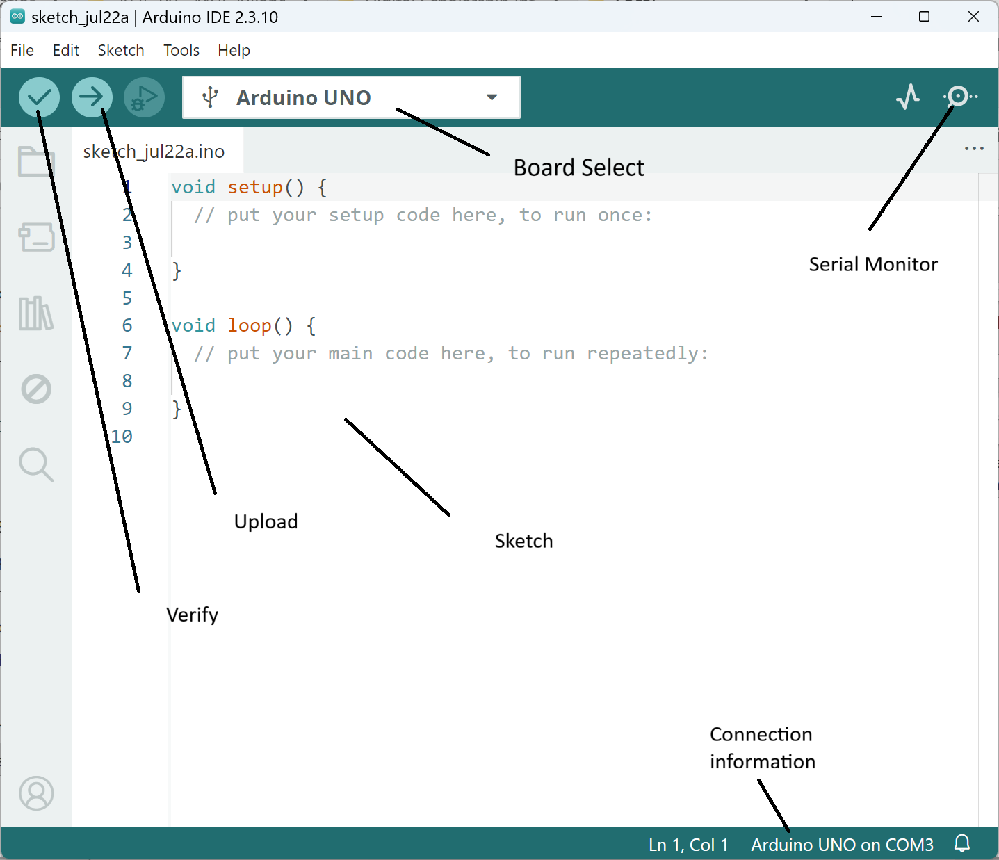
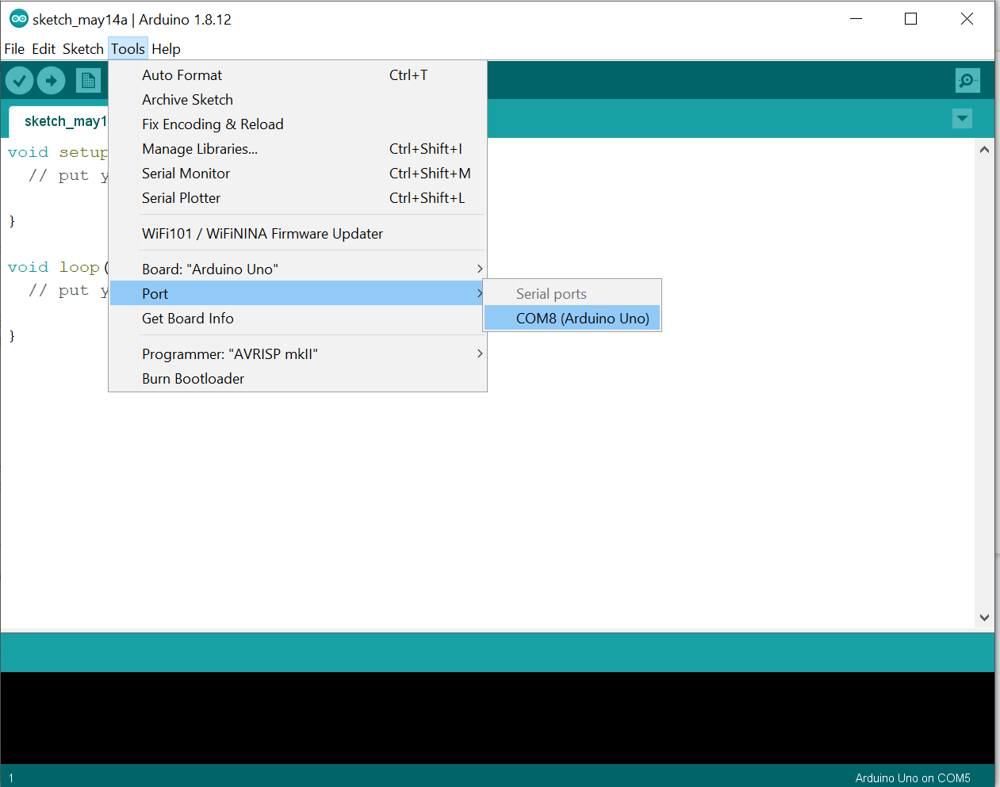
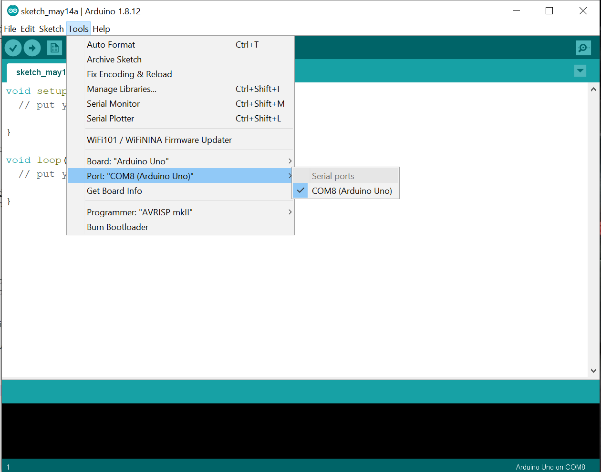
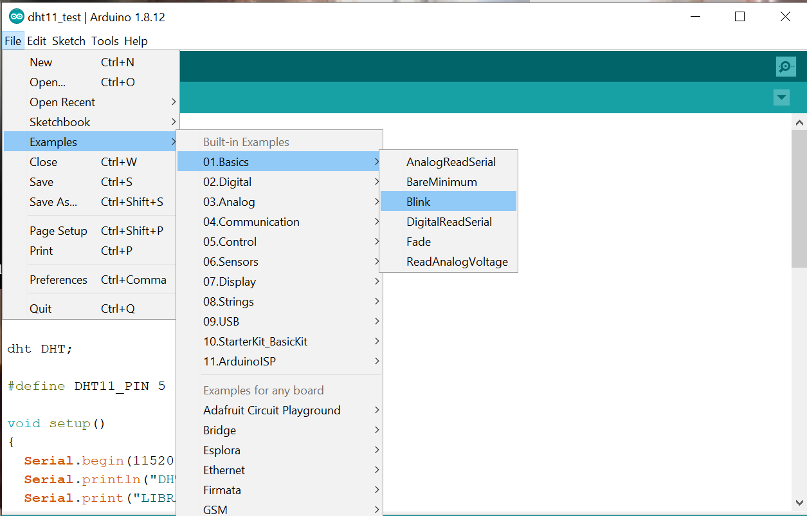
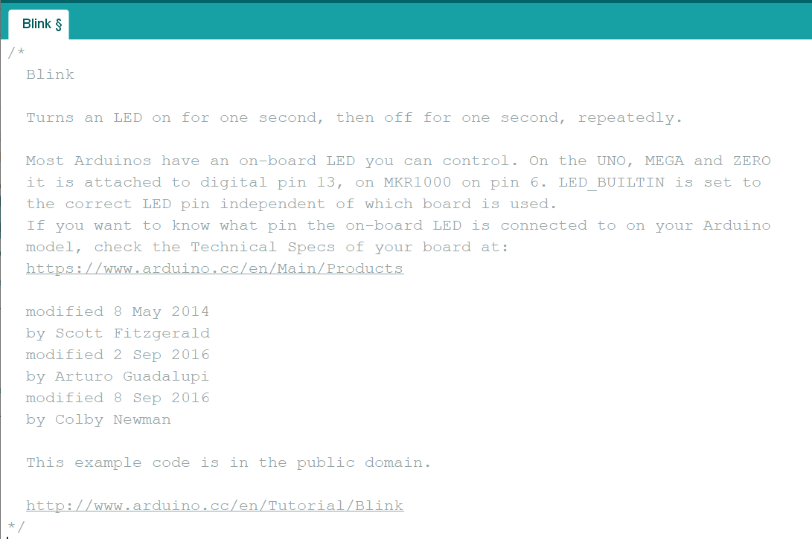
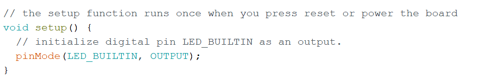
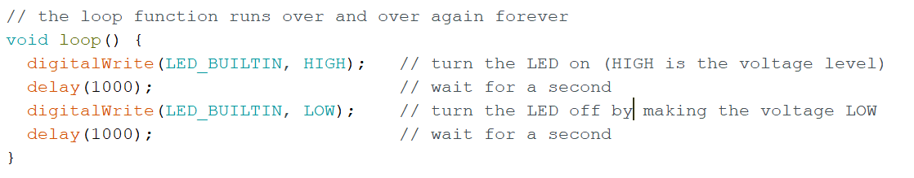
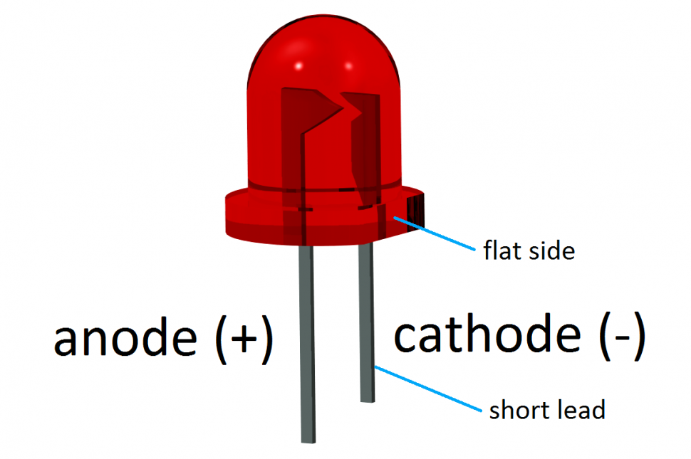

*Before starting this section, make sure you've completed all tasks in the [Preparation](preparation) page.*

# Lesson 1: Learning simple circuits
In this first lesson, you will learn how to connect your Arduino, interact with and program it via sketches on the Arduino IDE, and build some simple circuits using an LED. 

## Task 1: Connect your Arduino to your laptop
Now that you've unpacked your kit, it's time to plug in your Arduino and begin using it.

### 1.1 Plug it in!
- The Arduino can use the USB port to communicate with your computer, as well as draw power from it. Use the USB cable provided to connect the Arduino to your computer's USB port. If done correctly, the on-board LED labeled "**ON**" should light up. If this doesn't work, disconnect and attempt again. 
- Depending on what program was uploaded to your Arduino board last, you may or may not see the on-board LED (labeled `L`) light up or flash. Arduinos will run its uploaded program upon power-up, and will continue to do so until the *reset* button is pressed, the power is disconnected, or the board breaks. 
  - Note that the on-board LED lalebeled "**L**" is connected to digital input/output (IO) pin number 13; if the running program provides instructions for electrical current to be provided to pin 13, it'll be reflected in the on-board LED (whether or not anything is connected to digital pin 13). 

### 1.2 Establish a data connection
Once your Arduino is physically connected to your computer, open up the **Arduino IDE** from your laptop's program list. A new sketch window will appear. The sketch window contains a number of different areas, which are labeled below. You'll learn and use these functions througout the module.



Depending on your operating system, your Arduino may or may not be connected via a serial port (which allows for communication between the computer and the Arduino). 
- You can check the status of your connection by clicking on >Tools>Port. 

A physically connected Arduino should appear in the Serial Ports list as **COMX (Arduino UNO)** as shown below:



To establish the serial connection, click on the listed COM port that where the Arduino is connected. A checkmark should appear beside the port when a connection has been made.


## Task 2: Open a program and upload it to the Arduino
### 2.1 Open the program "blink"
In this exercise, you are going to upload your first program to the Arduino. For this case, we'll use one of the example programs that come with the Arduino IDE.
- Go to `>File>Examples>01.Basics` and click on **Blink**. This will open up a new sketch (what Arduino calls its programs) with the Blink program. 



### 2.2 Upload "blink" to the Arduino
- Ensuring that the Arduino is connected (both physically and through the COM port), click the upload button. 
  - The status window should first indicate that it is *Compiling sketch*, and then indicate that it is *Uploading*.
- If the upload was succesful, the status window will indicate *Done uploading*, and the info window will communicate the following (or similar):
```
Sketch uses 924 bytes (2%) of program storage space. Maximum is 32256 bytes.
Global variables use 9 bytes (0%) of dynamic memory, leaving 2039 bytes for local variables. Maximum is 2048 bytes.
```
***If you encounter an error***:
- If an error occurs, the status window will provide a general error message, and the info window will give additional information on it (you may need to scroll to see it). 
  - If the error occurred when uploading (i.e. a connection couldn't be made between the computer and the Arduino), the status window will read: *An error occurred while uploading the sketch*. 
  - If the error occurred when compiling the code (i.e. there's something wrong with your code), the status window will provide an error message, and the problematic line will be highlighted in the sketch. 

## Part 3: Understanding an Arduino sketch
The blink sketch provides a good opportunity to explore the three fundamental elements of an Arduino sketch. 

### The commented preface


The opening, grey-text section of the sketch is a block comment that contains human-readable information about the program. This section is ignored by the Arduino compiler, and its sole purpose is to provide humans (whether yourself or others) with more information on the code. Comments can be inserted into a sketch as a block using the ```/*``` and ```*/``` characters around the commented text, e.g:
```
/* 
All of this is 
a comment
*/
```

Comments are an important part of writing and maintaining computer code, as it's often much easier to understand what the code is doing when there is plain, human-readable text accompanying it. It's also important to record your changes over time. Additionally, you can use comments to temporarily remove certain lines of code that you don't want to be executed.

A good commented preface should contain some/all of the following information:
- What the code does.
- A description (or link to a diagram) of the circuit that it works alongside. 
- Links to any other information.
- Who created it, revised it, and when this was done.
- Information on licensing / rights on the code.


You'll also notice later in the sketch that comments are inserted on single lines (whether at the start or end) using the ```//``` characters: 
```
// This is a commented line
```

### The setup function


As mentioned in the comment above it, the setup function runs a single time when the board is turned on, reset, or when a new program is uploaded to it. The purpose of the setup function is to declare constants and run commands that configure the Arduino board to operate as desired in the following loop function. 

Note the general structure of a function used for the setup function (and other functions):

```
<returned_value> <name of function> (<input values>){
first command; //commands end with a semicolon
second command;
third command;
...
} // curly braces contain the commands at the top and bottom
```

In this casee, there is no returned value (the term ```void``` is used to indicate this), the name of the function is *setup*, there are no input values (thus the empty parentheses), and there is only one command executed.

#### Q1: 
- In this example, the only command executed in the setup function is ```pinMode(LED_BUILTIN, OUTPUT);```. What does this line do? 

#### A1: 
- ```pinmode``` is a built-in function that allows you to determine whether a given digital pin should be *INPUT* (receives current) or *OUTPUT* (delivers current). 
- The first *argument* to the function, ```LED_BUILTIN``` is a built-in constant that refers to digital pin 13, which is connected to the built-in LED on the Arduino board (labelled **"L"**). Note that you could replace ```LED_BUILTIN``` with ```13``` and it would work just the same. 
- The second *argument*, ```OUTPUT```, indicates that digital pin 13 should be set to output current.

### The loop function


As also indicated in the preceding comment, the loop function will run repeatedly for as long as the Arduino board is powered and operational. The loop function uses the same form as described above, and contains four lines of executed commands. 

#### Q2:
- What instructions are each of these lines providing to the Arduino board?

## Part 4: Modifying a sketch
Modify the Blink code so that the onboard LED blinks at a different frequency. **Remember** to save your code and upload it to the Arduino after you've modified it.

- How fast can you make it blink? 
- Can you make it blink at always-differing intervals? 

## Part 5: Inserting an LED
If you recall from earlier, the on-board LED (indicated by ```LED_BUILTIN``` in the Arduino code) is also connected to digital pin 13 on your Arduino board. You can connect an LED to this pin in a circuit by connecting one leg to digital pin 13 and the other to the adjacent pin labeled **GND**.
- The **GND** is the *ground* connection of the circuit. Circuits require a higher- and lower-voltage connection to permit current to pass through it. The ground pin often serves this purpose. In this case, digital pin 13 serves as the higher-voltage connection, and current flows from pin 13, through the LED and toward GND. 
- Try connnecting one of your standard (two-legged) LEDs. If it doesn't work, turn it around and connect it the other way. 

#### Question: 
- What happened? Did it work in both directions? 

#### Answer: 
- You probably noticed that it only worked in one direction. This is because an LED is a uni-directional device. Current must enter through the anode (connected to pin 13 in this case) and leave through the cathode (connected to GND in this case) for light to be generated. 
- The anode and cathode can usually be identified with a couple of visual queues: The anode has a longer leg, and the cathode has a flattened plastic bottom brim. 



## Part 6: Reviewing our circuit
So, you may be asking yourself at this point: *"Is that the proper way to connect that LED?"*. This is an excellent question. To find the answer:
- Navigate to the [Arduino tutorial page for Blink](https://www.arduino.cc/en/Tutorial/Blink) (which is provided in the comments of the Blink code)
- Note the hardware required
- Scroll down to view the circuit diagram. **What's missing from our current circuit?**

Before we move forward, you'll need to understand how to identify the proper resistor to place into the circuit. 

### Resistors 
Resistors are important elements of circuits, as they control the flow of current through a circuit. This may be necessary to ensure that a connected device works properly, or to protect it from being damaged by current that is too high. The higher the resistance of a resistor, the more current is restricted through it. The unit of resistance is referred to as the ohm (symbol &#937). Resistors use colour codes to indicate their resistance value--these may be communicated using 4- 5- or 6-band systems. 

Here's a diagram demonstrating the 4- and 5-band systems: 


And here's a further explanation of the examples: 


#### Question 1
Use the colour code above to answer the following questions: 
- What colour code would be found on a 10 Kohm (10000 ohm) resistor using: 
  - Four bands?
  - Five bands?

#### Answer 1
Use [resisto.rs](http://resisto.rs/) to assess your answer (enter ```10K``` into the box). A resource like [resisto.rs](http://resisto.rs/) is useful when you have a desired resistance and want to know the colour code.

#### Question 2
Identify all of the 10 Kohm resistors in your kit
- ***Hint***: there may be a mix of 4- and 5-band codes used

#### Question 3
Use the colour code chart to identify the resistance of the other resistors in your kit (hint: the rest all have the same resistance and all use a 4-band colour code).
- ***Hint:*** Use a resistor colour code calculator like [this](https://www.digikey.ca/en/resources/conversion-calculators/conversion-calculator-resistor-color-code-4-band) to assess your answer. These kind of calculators are useful when you have a resistor in hand (i.e. you know the colour code), and need to know its resistance.

## Part 7: Building a proper circuit
Now that you've properly identified the resistor you need for this circuit, how are you going to connect the pieces?
- You could attempt to twist the wires together, but you might break something and it won't be very reliable
- You could solder the pieces together, but we're just experimenting here. 
- **To connect this circuit, we're going to use a solderless breadboard**

### Solderless breadboard**
The solderless breadboard allows you to create circuits quickly without the need for soldering connections together. 
- Metal strips run through the backside of the breadboard, which connect specific rows and columns together in a defined manner: 


Note in the example above that connections run horizontally across rows of 5 on the inner part of the breadboard, while connections run vertically down the outside columns. 

### 7.1 Build a proper circuit
Create the proper blink circuit using: 
- The solderless breadboard
- The LED from the first circuit
- An appropriate resistor
- Jumper cables to connect the breadboard to the Arduino pins.
When you've succeeded, save your sketch to your local working folder with an appropriate name.

---  
**All done?** Let's move on to your [second lesson](mapping-our-data), where we will map our newly-collected data!
