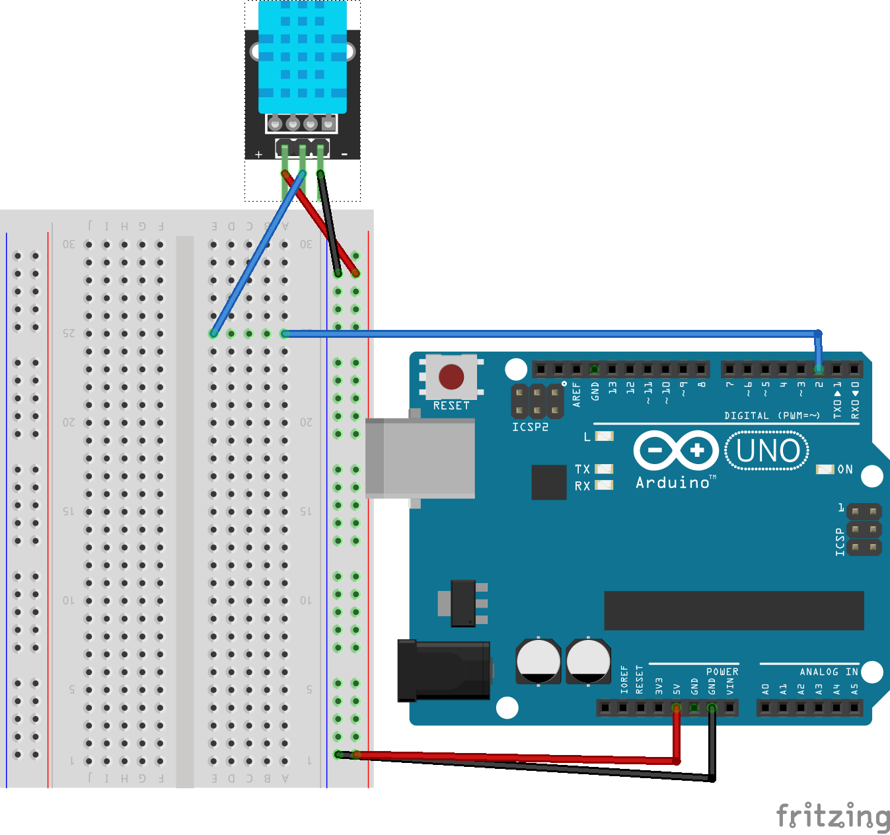
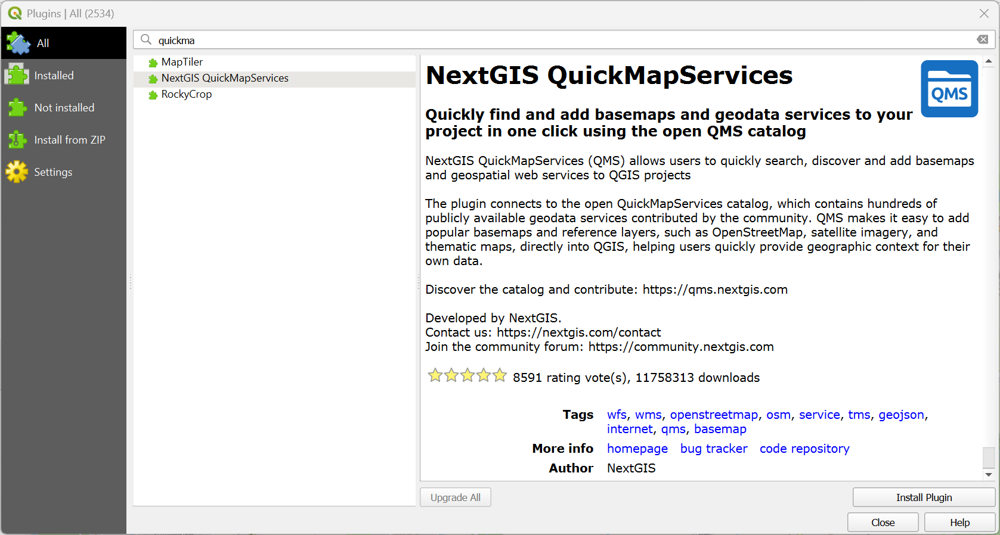
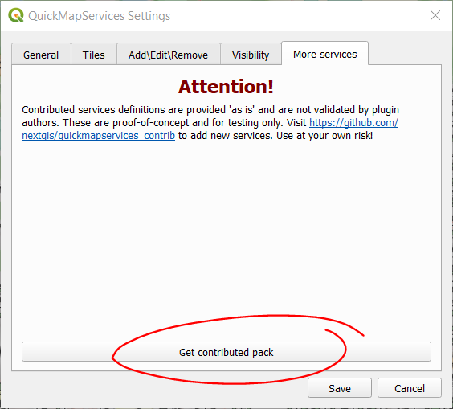
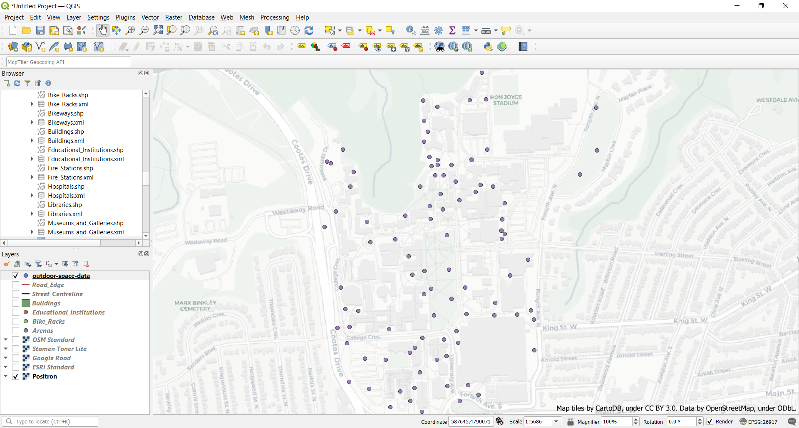

**FIND THIS WEBSITE AT [bit.ly/shad-weather-station](https://bit.ly/shad-weather-station)**

*Before starting this section, make sure you've completed all tasks in the [Preparation](preparation) page and completed [Lesson 1: Intro to GIS](intro-to-GIS).*

# Lesson 2: Connecting sensors 
In this lesson, you will build on the skills gained during [lesson 1](part-one), to connect some sensors to the Arduino.

- This part requires that you've installed the Adafruit DHT Library, as outlined on the [preparation](preparation) page. 
- From the top menu on the Arduino IDE, go to `File>Examples>DHT Sensor Library` and open the **DHTtester** sketch.
- VCC: Connect to 3.3V or 5V on your MCU (based on your sensor's specification).
- Data: Connect to a digital I/O pin on your MCU (not an analog pin). For the provided examples, we use digital pin 2 by default.
- Ground (GND): Connect to the ground of your MCU.

- On rows 15 and 16 of the `DHTtester.ino` sketch, do the following:
  - remove the comment (`//`) at the start of row 15
  - add a comment to the start of row 16.
  - Your updated code should look like the following:
    -
```
15	#define DHTTYPE DHT11   // DHT 11
16	//#define DHTTYPE DHT22   // DHT 22  (AM2302), AM2321
17	//#define DHTTYPE DHT21   // DHT 21 (AM2301)
```
- Upload your sketch to the Arduino
- Open the Serial Port. You should now see values from the sensor, e.g.,:
```
Humidity: 49.00%  Temperature: 24.10°C 75.38°F  Heat index: 23.84°C 74.92°F
Humidity: 49.00%  Temperature: 24.10°C 75.38°F  Heat index: 23.84°C 74.92°F
Humidity: 49.00%  Temperature: 24.10°C 75.38°F  Heat index: 23.84°C 74.92°F
Humidity: 49.00%  Temperature: 24.10°C 75.38°F  Heat index: 23.84°C 74.92°F
Humidity: 49.00%  Temperature: 24.10°C 75.38°F  Heat index: 23.84°C 74.92°F
```        
- Experiment with the sensor to see if it responds to different environments (e.g., close your hand on it; put it close to your breath). Did the values change? Was it what you expected? Did the change happen immediately or did the change take time? Which part of the sensor is most responsive? 

Full code for DHTtester:
```
// Example testing sketch for various DHT humidity/temperature sensors
// Written by ladyada, public domain

// REQUIRES the following Arduino libraries:
// - DHT Sensor Library: https://github.com/adafruit/DHT-sensor-library
// - Adafruit Unified Sensor Lib: https://github.com/adafruit/Adafruit_Sensor

#include "DHT.h"

#define DHTPIN 2     // Digital pin connected to the DHT sensor
// Feather HUZZAH ESP8266 note: use pins 3, 4, 5, 12, 13 or 14 --
// Pin 15 can work but DHT must be disconnected during program upload.

// Uncomment whatever type you're using!
#define DHTTYPE DHT11   // DHT 11
//#define DHTTYPE DHT22   // DHT 22  (AM2302), AM2321
//#define DHTTYPE DHT21   // DHT 21 (AM2301)

// Connect pin 1 (on the left) of the sensor to +5V
// NOTE: If using a board with 3.3V logic like an Arduino Due connect pin 1
// to 3.3V instead of 5V!
// Connect pin 2 of the sensor to whatever your DHTPIN is
// Connect pin 3 (on the right) of the sensor to GROUND (if your sensor has 3 pins)
// Connect pin 4 (on the right) of the sensor to GROUND and leave the pin 3 EMPTY (if your sensor has 4 pins)
// Connect a 10K resistor from pin 2 (data) to pin 1 (power) of the sensor

// Initialize DHT sensor.
// Note that older versions of this library took an optional third parameter to
// tweak the timings for faster processors.  This parameter is no longer needed
// as the current DHT reading algorithm adjusts itself to work on faster procs.
DHT dht(DHTPIN, DHTTYPE);

void setup() {
  Serial.begin(9600);
  Serial.println(F("DHTxx test!"));

  dht.begin();
}

void loop() {
  // Wait a few seconds between measurements.
  delay(2000);

  // Reading temperature or humidity takes about 250 milliseconds!
  // Sensor readings may also be up to 2 seconds 'old' (its a very slow sensor)
  float h = dht.readHumidity();
  // Read temperature as Celsius (the default)
  float t = dht.readTemperature();
  // Read temperature as Fahrenheit (isFahrenheit = true)
  float f = dht.readTemperature(true);

  // Check if any reads failed and exit early (to try again).
  if (isnan(h) || isnan(t) || isnan(f)) {
    Serial.println(F("Failed to read from DHT sensor!"));
    return;
  }

  // Compute heat index in Fahrenheit (the default)
  float hif = dht.computeHeatIndex(f, h);
  // Compute heat index in Celsius (isFahreheit = false)
  float hic = dht.computeHeatIndex(t, h, false);

  Serial.print(F("Humidity: "));
  Serial.print(h);
  Serial.print(F("%  Temperature: "));
  Serial.print(t);
  Serial.print(F("°C "));
  Serial.print(f);
  Serial.print(F("°F  Heat index: "));
  Serial.print(hic);
  Serial.print(F("°C "));
  Serial.print(hif);
  Serial.println(F("°F"));
}
```

- (JB) **Talk about how it works**


## Task 0: Download our data set
- Download our ```outdoor-space-data.csv``` file (as a zip file) using [this link](https://jasonbrodeur.github.io/SHAD-mapping/data/outdoor-space-data.csv) (or at [bit.ly/shad-outdoor-space-data](https://bit.ly/shad-outdoor-space-data)). This file is hosted on our [workshop GitHub repository](https://github.com/jasonbrodeur/SHAD-mapping/blob/main/data/).
- Download the data into the same working directory as the first exercise. 
- **UNZIP THE FILE**. This is very important--otherwise, weird things are going to happen for you.   

## Task 1: Open a new project, add a plugin and a web base map
For this exercise, we want to add a web map as a base map upon which to show our data. To do this, we'll use the `NextGIS QuickMapServices` plugin for QGIS.  

**NOTE:** The following exercises require the `NextGIS QuickMapServices` and `qgis2web` plugins to be installed, as instructed in the [Preparation](preparation) section of this lesson. If you have not installed them, do so now and then return to these instructions. 

- Open a new project. Set the project CRS to ```EPSG 3857: WGS84 - Pseudo Mercator projection```
<!--
	- As an open-source project QGIS has a lot of community-contributed Plugins that extend its functionality. Over time, many of these plugins find their way into the core software.
- Install the QuickMapServices plugin:
	- In the top menu bar, click on ```Plugins > Manage and Install Plugins```.
	- In the Plugins dialogue box, search for and install the **NextGIS QuickMapServices** plugin. 
	- 

  	- To allow us to add additional web layers, on the top menu, click ```Web > QuickMapServices > Settings```. Go to the **More Services** tab and click **Get contributed pack**. Close the window.
	- 
- While the Plugin window is open, also install the **qgis2web** plugin.
- Once the plugins are installed, close the plugins window.	
-->
- Add a web base map to your data frame: 
	- In the top menu bar, click on ```Web > QuickMapServices```.
	- Explore and add a base map of your liking. 
	- Choose a web map for your base map (e.g. check out the OSM and CartoDB maps). Note that some maps may not be available due to usage restrictions.
	- Be sure to right-click and ```Remove Layer``` for any layer you don't want to use. 

## Task 2: Add our data file, turn it into a spatial layer 
- In the top menu, click on ```Layer > Add Layer > Add Delimited Text Layer...```.
- Browse to the ```outdoor-space-data.csv``` file, select and Open it.
- Enter the following information: 
	- **File Format**: CSV
	- **Geometry Definition**: ```X field``` : ```Longitude``` ; ```Y field``` : ```Latitude```.
	- **Geometry CRS**: EPSG:4326 - WGS 84
- Click **Add**. When prompted about a transformation, just click OK. 
- Our survey points should now show on the map in the expected locations (i.e. McMaster University).


## Task 3: Stylize symbols to communicate the suitability score and size of the plot
- Ensure that the ```outdoor-space-data``` layer is above your web map in the **Layer panel**.
- Right click the ```outdoor-space-data``` layer and select ```Properties```. Click on the ```Symbology``` tab
- In the top dropdown menu, change to ```Graduated```
- In the **Value** dropdown, select a measure of interest (i.e. Suitability Score)
- In the **Symbol** area, click the current symbol to change it. 
	- In the symbol dialogue box, click the more options icon beside the **Size** setting. 
	- Select ```Edit```. In the Expression box, enter ```"Num Seats" /10``` -- this will scale the size of the marker to the number of seats that are available at the location. 
	- Click OK
- Select a Color ramp from the dropdown menu. Be thoughtful with your colour selection: think about what kind of message/sentiment do your selected colours convey. Is it aligned with what you're communicating in your map? 
- Click ```Classify``` and observe that 5 classes are created. Click **Apply** to see the changes on the map.
- Click OK on the Properties box.
- In the ```Layer Rednering``` box, edit the transparency of this layer so that the webmap beneath shows a bit.
- Click OK to exit the layer properties dialog box.

## Task 4: Add other layers (if desired)
- If you would like to augment your map with other data, add Hamilton Open Data layers and style them appropriately. 

## Task 5: Compose your map
- Zoom the main data frame to the approximate desired extents for your map.
- Click on the **New Print Layout** button to open the map creation window. 
	- Give your map a name when the dialog box comes up. 
- In the map composer, add the critical elements of a map: 
	- Click the **Add new map** button and then draw a box to specify your map’s extent on the page. This will draw the contents of your data frame onto the map. 
	- Use the **Move Item Content* button to change the extent and zoom. Click “Update Preview” in the “Main Properties” box to regenerate preview.
- WIth the map content selected, go to **Item Properties** and add a frame (if desired), a grid, or both.
- See [this video](http://goo.gl/3yPkme) for some examples of how to style the map.  

## Task 6: Annotate the map 
- Use **Add New Labels** button to add any desired labels (Use “Item Properties” tab to control font size, colour, background)
- Use the **Add North Arrow** button to add a North arrow
	- With the north arrow selected, scale it to the right size
	- Go to ``` > Item Properties``` to select symbol different than the default. 
- Use the **Add Label** button to add a title. Include the creator name and creation date
- Use the “Add legend” button to insert a legend, if desired. 
	- With the legend selected, click the “Item Properties” tab, rename and rearrange the legend items
- Use the **Add Scale Bar**  tool to insert a scale bar 
	- Drag the bar to the desired location and size. Edit other details in the **Items Properties** box, if desired.
	- Set units to Meters, and Label to “m” (if not already done for your) 
	- Select desired number of segments,

## Task 7: Export the map to an image file
- In the map composer, use either the **Export as image** or **Export as PDF** buttons to export the map in the desired format to a desired directory. 

## Task 8: Save your project 
- Save your project and close the map composer window. Keep your project open in the main QGIS interface.  

**Are you ready for your final challenge?** Head to the [next lesson](publish-webmap) to learn how to create and publish a webmap using QGIS and GitHub!
