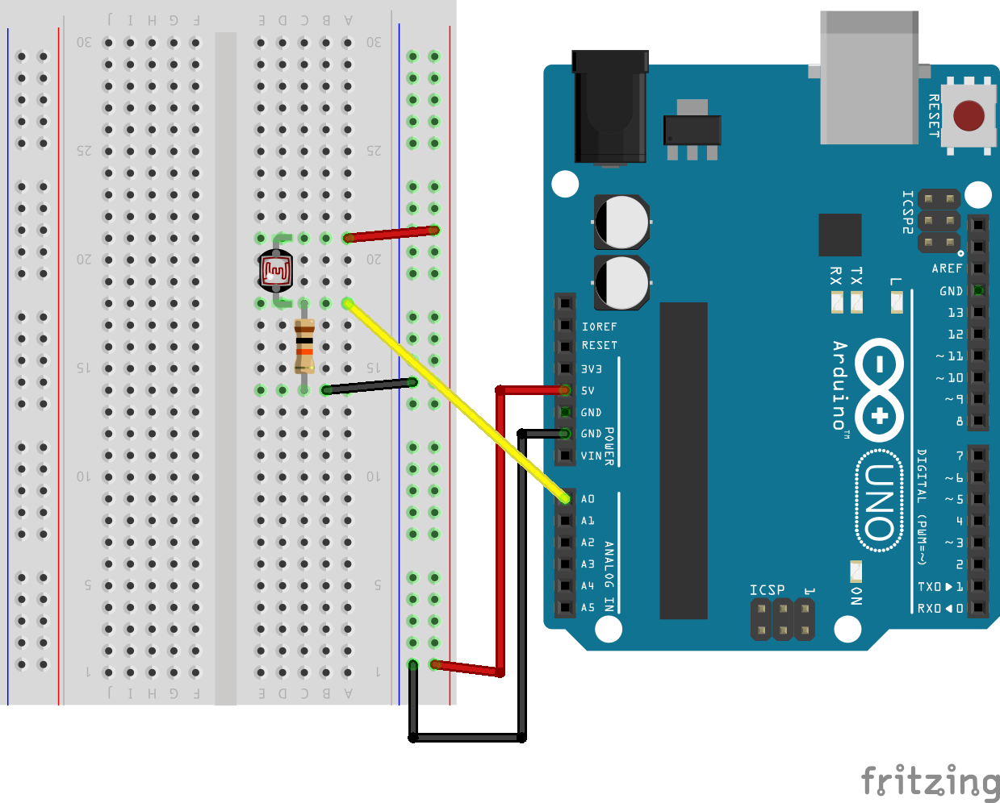
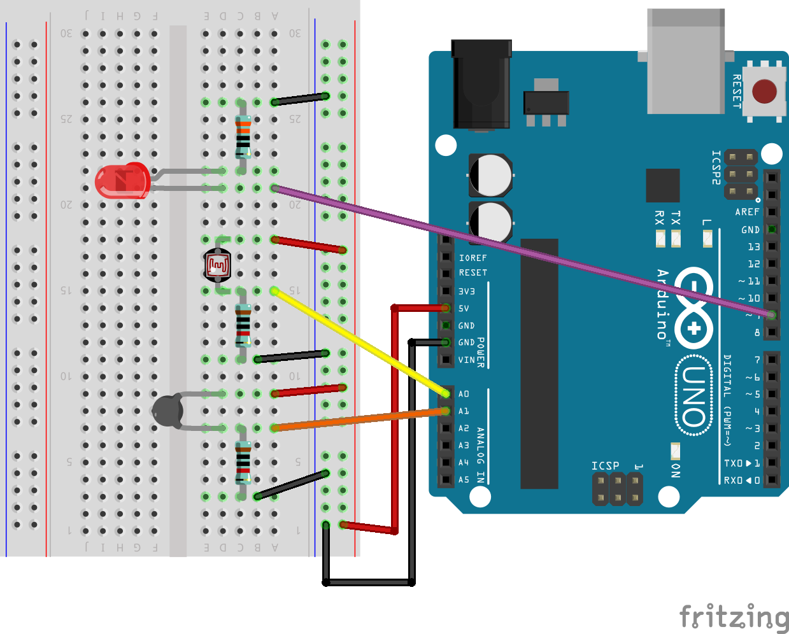
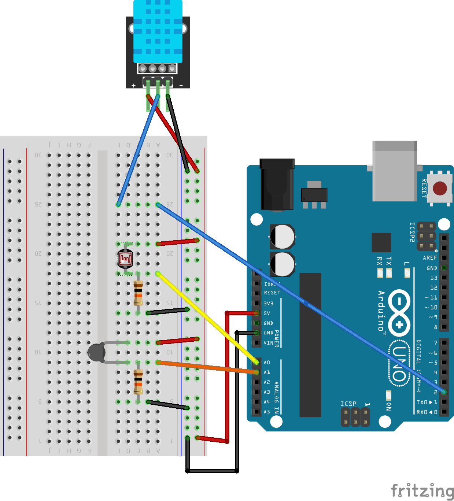

**FIND THIS WEBSITE AT [bit.ly/shad-weather-station](https://bit.ly/shad-weather-station)**

# Lesson 2: Connecting sensors 
In this lesson, you will build on the skills gained during [lesson 1](part-one), to connect some sensors to the Arduino. We will add sensors one at a time; by the end, your will have your weather station constructedand working. We will add sensors in this order: 
1. Photoresistor: light-sensitive resistor, used to measure light intensity
2. THermistor: temperature-sensitive resistor, used to measure temperature
3. DHT11 Sensor: A combined temperature + humidity sensor.

## Task 1: Connecting a Photoresistor
In this exercise, you will connect the photoresistor to your Arduino using the breadboard to measure light intensity. Your uploaded code will measure current through the photoresitor to estimate light intensity (higher current = greater light intensity). 

Connect the components using the wiring diagram below and copy the code into a new sketch and upload it to the Arduino. Once uploaded, experiment with differing amount of light on the sensor (cover it with your hand, shine your phone's flashlight on it) to see what happens.

### 1.1 Connect the circuits
Follow the wiring diagram below to build the circuit.

  

### 1.2 Upload the code
Copy and paste the code below into a blank sketch (replace anything already existing in the sketch), and then upload it to your Arduino. Alternatively, you can download the full sketch [here](https://jasonbrodeur.github.io/SHAD-weather-station/assets/sketches/Photoresistor.ino).

```
/*
  Photoresistor -- modified from Analog input, analog output, serial output

  Reads an analog input pin, maps the result to a range from 0 to 255 and uses
  the result to set the pulse width modulation (PWM) of an output pin.
  Also prints the results to the Serial Monitor.

  The circuit:
  1. Photoresistor:
  - one leg of photoresistor connected to analog pin 0 (A0). Same leg is connected to +5V
  - other leg of the photoresistor is connected to a 10 kOhm resistor
  - Other end of the 10 kOhm resistor is connected to GND (ground)
  2. LED:
  - One leg of the LED is connected to Arduino digital pin 9
  - The other leg is connected to a 330 ohm resistor
  - Other end of the 330 Ohm resistor is connected to GND (ground)

  created 29 Dec. 2008
  modified 9 Apr 2012
  by Tom Igoe
  modified July 2026 by Jay Brodeur

  This example code is in the public domain.
Wiring example: 
https://github.com/jasonbrodeur/SHAD-weather-station/blob/main/assets/img/photoresistor-wiring.png
*/

// These constants won't change. They're used to give names to the pins used:
const int analogInPin = A0;  // Analog input pin that the potentiometer is attached to
const int analogOutPin = 9;  // Analog output pin that the LED is attached to

int sensorValue = 0;  // value read from the photoresistor
int outputValue = 0;  // value output to the LED

void setup() {
  // initialize serial communications at 9600 bps:
  Serial.begin(9600);
}

void loop() {
  // read the analog in value:
  sensorValue = analogRead(analogInPin);
  // map it to the range of the analog out:
  outputValue = map(sensorValue, 0, 1023, 0, 255);
  // change the analog out value:
  analogWrite(analogOutPin, outputValue);

  // print the results to the Serial Monitor:
  Serial.print("photoresistor = ");
  Serial.print(sensorValue);
  Serial.print("\t LED output intensity = ");
  Serial.println(outputValue);

  // wait 50 milliseconds before the next loop for the analog-to-digital
  // converter to settle after the last reading:
  delay(50);
}
```
### 1.3 Monitor the output | Test and experiment
- Open the Serial Monitor (icon on top-right or from the top menu: `Tools > Serial Monitor`. Confirm that the program is outputting values and they seem as expected (photoresistor values should range between 0 and 1023; LED output between 0 and 255).
- Experiment with differing amounts of light on the sensor (cover it with your hand, shine your phone's flashlight on it) to see what happens. Do the values change as expected? If so, does it respond as expected? How quickly does the sensor respond to changes?

### 1.4 Save your sketch
- Save your sketch to your laptop. Name it appropriately. 

## Task 2: Add a Thermistor to the circuit
In this exercise, you will add to your photoresistor circuit by including a thermistor to measure temperature. Your uploaded code will measure current through the photoresitor to estimate light intensity (higher current = greater light intensity), and temperature through the thermistor.

### 2.1 Connect the circuits
Follow the wiring diagram below to build the circuit.

  

### 2.2 Upload the code
Copy and paste the code below into a blank sketch (replace anything already existing in the sketch), and then upload it to your Arduino. Alternatively, you can download the full sketch [here](https://jasonbrodeur.github.io/SHAD-weather-station/assets/sketches/Photoresistor_Thermistor.ino).

```
/*
  Photoresistor_Thermistor -- modified from Analog input, analog output, serial output

  Reads an analog input pin, maps the result to a range from 0 to 255 and uses
  the result to set the pulse width modulation (PWM) of an output pin.
  Also prints the results to the Serial Monitor.

  The circuit:
  1. Photoresistor:
  - one leg of photoresistor connected to analog pin 0 (A0). Same leg is connected to +5V
  - other leg of the photoresistor is connected to a 10 kOhm resistor
  - Other end of the 10 kOhm resistor is connected to GND (ground)
  2. LED:
  - One leg of the LED is connected to Arduino digital pin 9
  - The other leg is connected to a 330 ohm resistor
  - Other end of the 330 Ohm resistor is connected to GND (ground)
  3. Thermistor
  - One leg of thermistor connected to analog pin 1 (A1). Same leg is connected to +5V
  - other leg of the photoresistor is connected to a 10 kOhm resistor
  - Other end of the 10 kOhm resistor is connected to GND (ground)

  created 29 Dec. 2008
  modified 9 Apr 2012
  by Tom Igoe
  modified July 2026 by Jay Brodeur

  This example code is in the public domain.
Wiring example: 
https://github.com/jasonbrodeur/SHAD-weather-station/blob/main/assets/img/photoresistor-thermistor-wiring.png
*/

#include <math.h> // include the math library

// These constants won't change. They're used to give names to the pins used:
const int PrPin = A0;  // Analog input pin that the photoresistor is attached to
const int ThPin = 1;  // Analog input pin that the thermistor is attached to
const int analogOutPin = 9;  // Analog output pin that the LED is attached to

// intermediate variables (for thermistor temperature calculation): 
float vcc = 4.91;                       // only used for display purposes, if used set to the measured Vcc.
float pad = 9850;                       // balance/pad resistor value, set this to the measured resistance of your pad resistor
float thermr = 10000;                   // thermistor nominal resistance

// create variables for output:
int sensorValue_PR = 0;  // value read from the photoresistor
float temp = 0;  // temperature
int outputValue = 0;  // value output to the PWM (analog out)

// A function to measure and calculate temperature =====
float Thermistor(int RawADC) {
  long Resistance;  
  float Temp;  // Dual-Purpose variable to save space.

  Resistance=pad*((1024.0 / RawADC) - 1);
  Temp = log(Resistance); // Saving the Log(resistance) so not to calculate  it 4 times later
  Temp = 1 / (0.001129148 + (0.000234125 * Temp) + (0.0000000876741 * Temp * Temp * Temp));
  Temp = Temp - 273.15;  // Convert Kelvin to Celsius                      

  
  // Uncomment this line for the function to return Fahrenheit instead.
  //temp = (Temp * 9.0)/ 5.0 + 32.0;                  // Convert to Fahrenheit
  return Temp;                                      // Return the Temperature
}
// =====================================================


void setup() {
  // initialize serial communications at 9600 bps:
  Serial.begin(9600);
}

void loop() {
  // %%% Photoresistor code 
  // read the analog in value:
  sensorValue_PR = analogRead(PrPin);
  // map it to the range of the analog out:
  outputValue = map(sensorValue_PR, 0, 1023, 0, 255);
  // change the analog out value:
  analogWrite(analogOutPin, outputValue);

  // %%% Read from Thermistor
  temp=Thermistor(analogRead(ThPin));       // read ADC and  convert it to Celsius

  // print the results to the Serial Monitor:
  Serial.print("photoresistor = ");
  Serial.print(sensorValue_PR);
  //Serial.print("\t LED output intensity = ");
  //Serial.print(outputValue);
  Serial.print("\t Thermistor temperature (deg C)= ");
  Serial.println(temp);

  // wait 100 milliseconds before the next loop for the analog-to-digital
  // converter to settle after the last reading:
  delay(100);
}
```

### 2.3 Monitor the output | Test and experiment
- Open the Serial Monitor (icon on top-right or from the top menu: `Tools > Serial Monitor`. Confirm that the program is outputting values and they seem as expected (photoresistor and thermistor).
- Change the temperature of the sensor (put your finger on it, breath on it, place a cold piece of metal on it) to see what happens. Do the values change as expected? If so, does it respond as expected? How quickly does the sensor respond to changes?

### 2.4 Save your sketch
- Save your sketch to your laptop. Name it appropriately.


## Task 3: Add a DHT11 sensor to complete the weather station
**NOTE**: This part requires that you've installed the Adafruit DHT Library, as outlined on the [preparation](preparation) page.  
In this exercise, you will add the final piece to your weather station: A DHT11 temperature and humidity sensor. Your uploaded code will measure light intensity with the photoresitor, temperature with the thermistorm, and temperature and humidity with the DHT11. 

### 3.1 Connect the circuits
Follow the wiring diagram below to build the circuit.

  

### 3.2 Upload the code
Copy and paste the code below into a blank sketch (replace anything already existing in the sketch), and then upload it to your Arduino. Alternatively, you can download the full sketch [here](https://jasonbrodeur.github.io/SHAD-weather-station/assets/sketches/Wx_Station.ino).

```
/*
  Photoresistor -- modified from Analog input, analog output, serial output

  Reads an analog input pin, maps the result to a range from 0 to 255 and uses
  the result to set the pulse width modulation (PWM) of an output pin.
  Also prints the results to the Serial Monitor.

  The circuit:
  1. Photoresistor:
  - one leg of photoresistor connected to analog pin 0 (A0). Same leg is connected to +5V
  - other leg of the photoresistor is connected to a 10 kOhm resistor
  - Other end of the 10 kOhm resistor is connected to GND (ground)
  2. LED:
  - One leg of the LED is connected to Arduino digital pin 9
  - The other leg is connected to a 330 ohm resistor
  - Other end of the 330 Ohm resistor is connected to GND (ground)
  3. Thermistor
  - One leg of thermistor connected to analog pin 1 (A1). Same leg is connected to +5V
  - other leg of the photoresistor is connected to a 10 kOhm resistor
  - Other end of the 10 kOhm resistor is connected to GND (ground)
  4. DHT11
  - Left leg connects to 5V
  - Middle leg connects to Digital Pin 2
  - Right leg connects to GND (Ground)

  created 29 Dec. 2008
  modified 9 Apr 2012
  by Tom Igoe
  modified July 2026 by Jay Brodeur

  This example code is in the public domain.
Wiring example: 
https://docs.arduino.cc/built-in-examples/analog/AnalogInput/
*/
// Include libraries
#include <math.h> // include the math library
// DHT11 REQUIRES the following Arduino libraries:
// - DHT Sensor Library: https://github.com/adafruit/DHT-sensor-library
// - Adafruit Unified Sensor Lib: https://github.com/adafruit/Adafruit_Sensor
#include "DHT.h"

// These constants won't change. They're used to give names to the pins used:
const int PrPin = A0;  // Analog input pin that the photoresistor is attached to
const int ThPin = 1;  // Analog input pin that the thermistor is attached to
const int analogOutPin = 9;  // Analog output pin that the LED is attached to
#define DHTPIN 2     // Digital pin connected to the DHT sensor
#define DHTTYPE DHT11   // DHT 11
//#define DHTTYPE DHT22   // DHT 22  (AM2302), AM2321
//#define DHTTYPE DHT21   // DHT 21 (AM2301)

// intermediate variables (for thermistor temperature calculation): 
float vcc = 4.91;                       // only used for display purposes, if used set to the measured Vcc.
float pad = 9850;                       // balance/pad resistor value, set this to the measured resistance of your pad resistor
float thermr = 10000;                   // thermistor nominal resistance

// create variables for output:
int sensorValue_PR = 0;  // value read from the photoresistor
float temp = 0;  // temperature
int outputValue = 0;  // value output to the PWM (analog out)

// A function to measure and calculate temperature =====
float Thermistor(int RawADC) {
  long Resistance;  
  float Temp;  // Dual-Purpose variable to save space.

  Resistance=pad*((1024.0 / RawADC) - 1);
  Temp = log(Resistance); // Saving the Log(resistance) so not to calculate  it 4 times later
  Temp = 1 / (0.001129148 + (0.000234125 * Temp) + (0.0000000876741 * Temp * Temp * Temp));
  Temp = Temp - 273.15;  // Convert Kelvin to Celsius                      


  // Uncomment this line for the function to return Fahrenheit instead.
  //temp = (Temp * 9.0)/ 5.0 + 32.0;                  // Convert to Fahrenheit
  return Temp;                                      // Return the Temperature
}
// =====================================================

// Initialize DHT sensor.
DHT dht(DHTPIN, DHTTYPE);

void setup() {
  // initialize serial communications at 9600 bps:
  Serial.begin(9600);
  // Start the DHT
  Serial.println(F("DHT11 test!"));
  dht.begin();
}

void loop() {
  // %%% Photoresistor code 
  // read the analog in value:
  sensorValue_PR = analogRead(PrPin);
  // map it to the range of the analog out:
  outputValue = map(sensorValue_PR, 0, 1023, 0, 255);
  // change the analog out value:
  analogWrite(analogOutPin, outputValue);

  // %%% Read from Thermistor
  temp=Thermistor(analogRead(ThPin));       // read ADC and  convert it to Celsius

  // Read from DHT
  // Reading temperature or humidity takes about 250 milliseconds!
  // Sensor readings may also be up to 2 seconds 'old' (its a very slow sensor)
  // Read relative humidity as % 
  float dht_hum = dht.readHumidity();
  // Read temperature as Celsius (the default)
  float dht_temp = dht.readTemperature();
 // Compute heat index in Celsius (isFahreheit = false)
  float dht_hi = dht.computeHeatIndex(dht_temp, dht_hum, false);


  // print the results to the Serial Monitor:
  Serial.print("photoresistor = ");
  Serial.print(sensorValue_PR);
  //Serial.print("\t LED output intensity = ");
  //Serial.print(outputValue);
  Serial.print(" | Thermistor T (C)= ");
  Serial.print(temp);
  Serial.print(" | DHT T (C)= ");
  Serial.print(dht_temp);
  Serial.print(" | DHT RH (%)= ");
  Serial.print(dht_hum);
  Serial.print(" | DHT humidex (dec C)= ");
  Serial.println(dht_hi);

  // wait 2000 milliseconds (2 seconds) before the next loop for the analog-to-digital
  // converter to settle after the last reading:
  delay(2000);
}
```
### 3.3 Monitor the output | Test and experiment
- Open the Serial Monitor (icon on top-right or from the top menu: `Tools > Serial Monitor`. Confirm that the program is outputting values and they seem as expected (photoresistor and thermistor).
- Change the temperature and humidity of the DHT11 sensor (put it in your hand, breath on it, etc.) to see what happens. Do the values change as expected? If so, does it respond as expected? How quickly does the sensor respond to changes?

### 3.4 Save your sketch
- Save your sketch to your laptop. Name it appropriately. 

## Task 4: If you finish early
You have a few options if your finish early: 
1. (if your PAs allow) take your weather station outside laptop and wiring and place it in a few different environments (shady, sunny, grassy, paved, etc.). Did the measured values change significantly and as expected?
2. Add to your weather station by connecting the buzzer. Make it play a noise when the temperature passes a certain threshold.
  - HINT: look up the Arduino [if condition](https://docs.arduino.cc/language-reference/en/structure/control-structure/if/) for guidance on creating conditional logic, and check out the [toneMelody](https://docs.arduino.cc/built-in-examples/digital/toneMelody/) example to see how the buzzer can be used to make sound.  

---
**Are you ready for your final challenge?** Head to the [final lesson](part-three) to learn more about temperature measurement, weather stations, and to build your own enclosure!
