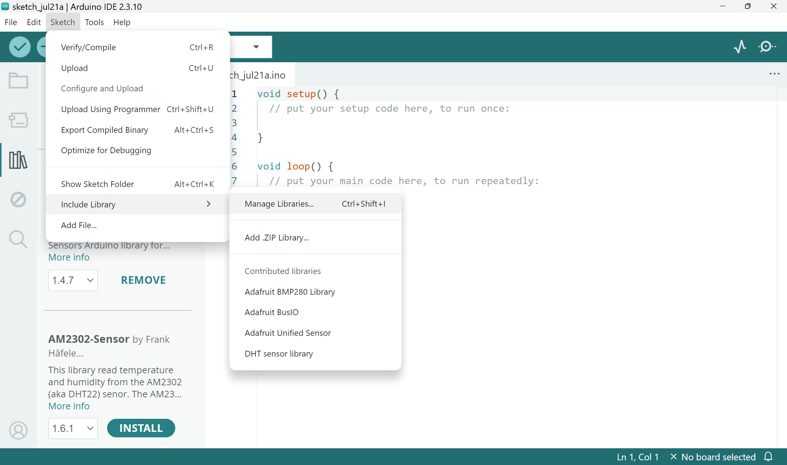
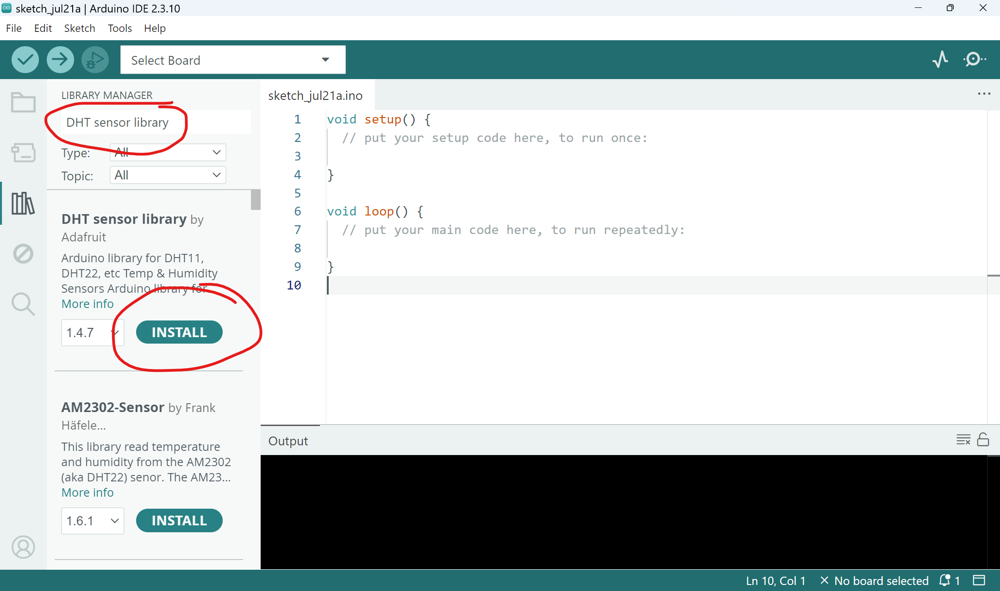
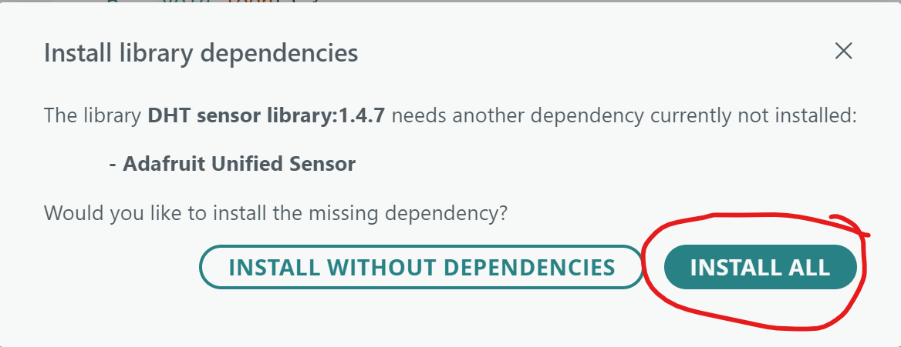

# Preparation
In this workshop, we will build a weather station using simple sensors, the open source [Arduino UNO microcontroller](https://store.arduino.cc/products/arduino-uno-rev3), and the [Ardiuno IDE](https://www.arduino.cc/en/software/) to program it.  

Prior to the workshop, please do the following: 

## 1. Identify if you have a compatible laptop
For this workshop, it is strongly recommended that groups install and use the desktop version of the Arduino IDE (version 2.3.10), which is available for Windows (versions 10 and 11), Linux, and macOS. Chromebook users can attempt to install Arduino Cloud via the Play store; however, this interface differs from the desktop version and may make it more difficult to follow along. 

The Arduino board connects to a laptop via a USB Type A connection (see image below). If you do not have a USB Type A port, you will need to use a dongle that provides one (Jay also has 10 USB type C to type A adapters people can use).   

Ideally, at least two people per 4-person group have compatible laptops. 

## 2. Install the Arduino IDE (if compatible)
For this workshop, it is strongly recommended that groups install and use the desktop version of the Arduino IDE (version 2.3.10), which is available for Windows (versions 10 and 11), Linux, and macOS via the [Arduino IDE download page](https://www.arduino.cc/en/software/#:~:text=Bring%20Your%20Projects%20to%20Life%20with%20Arduino%20Software). At least one member of each 4-person group needs the IDE installed, but more are better.  

Chromebook users can attempt to install Arduino Cloud via the [Play store](https://www.arduino.cc/en/software/#:~:text=Arduino%20Cloud%20on%20Chromebook); however, this interface differs from the desktop version and may make it more difficult to follow along. 

## 3. Install libraries 
One of our sensors (the DHT11 temperature and humidity sensor) requires additional libraries to be installed via the Arduino Library Manager. Follow these steps to install: 
1. Open the Arduino IDE on your laptop.
2. From the top menu, go to `Sketch > Include Library`. Click on `Manage Libraries` to open the Library Manager. 

3. Search for "DHT Sensor Library" and click to install the *DHT sensor library by Adafruit*. If prompted to also install the *Adafruit Unified Sensor* library, choose to `INSTALL ALL`. 

4. If you were not prompted to install the *Adafruit Unified Sensor* library in the previous step, search for and install it.
   
---

**All done?** Move on to [part one](part-one).
