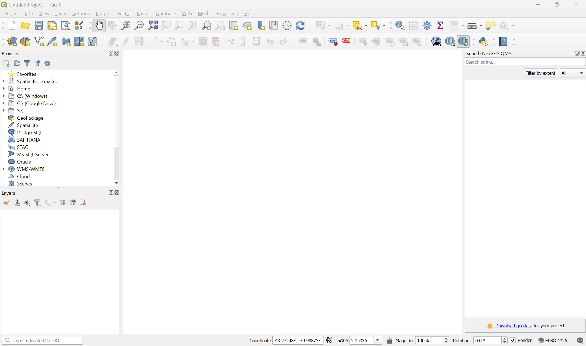

# Preparation
In this workshop, you will work with [QGIS software](https://qgis.org/en/site/) for spatial analyses and mapping, and [GitHub](https://github.com) to share your data and final products.  

Prior to the workshop, please do the following: 

## 1. Preparing QGIS 
In this workshop, we will work with QGIS **version 3.44 LTR (Long-term release)** (please note the version). 

### 1.1 Download and install QGIS
QGIS can be downloaded and used on Windows, MacOS, and Linux machines, though the installation instructions differ slightly between operating systems. To download it for your operating system, go [here](https://qgis.org/download/) and follow the installation instructions. **Please do not** install the tablet/phone version for this exercise--these are limited-feature versions of the software and they will not work for our exercises. 

### 1.2 Confirm QGIS is working 
On your computer, open **QGIS Desktop**. If the application loads properly, you should see a default QGIS interface similar to what is shown below: 



### 1.3 Install plugins
As an open-source project, QGIS has a lot of community-contributed plugins that extend its functionality. Over time, many of these plugins find their way into the core software. We will use a couple of these for our exercise. Follow the instructions below to install them. 
1. Install the NextGIS QuickMapServices plugin:
	- In the top menu bar, click on `Plugins > Manage and Install Plugins`.
	- In the Plugins dialogue box, search for and install the **NextGIS QuickMapServices** plugin. 
	- 
2. Confirm that the plugin works:
    - In the QGIS top menu bar, click on `Web > QuickMapServices`
    - Select to load the OSM Standard webmap by clicking on `OpenStreetMap > OSM Standard`.
    - The OpenStreetMap layer should load so you can zoom into/out of it.
3. Install the qgis2web plugin:
 	- In the top menu bar, click on `Plugins > Manage and Install Plugins`.
	- In the Plugins dialogue box, search for and install the **qgis2web** plugin.

## 2. Download workshop data
In this workshop, we'll learn how to use QGIS by using data that is available from the City of Hamilton [Open Data Portal](https://www.hamilton.ca/city-council/data-maps/open-data). The open data portal has a wide variety of numeric and geospatial data sets that are free and open to use. Many cities and regions now have similar kinds of open data portals, so be sure to check if you're ever doing analyses on your local area!

To download the data: 
- Download ```hamilton-data.zip``` from the [workshop GitHub repository](https://github.com/jasonbrodeur/SHAD-mapping/blob/main/data/hamilton-data.zip) by clicking [this link](https://github.com/jasonbrodeur/SHAD-mapping/raw/main/data/hamilton-data.zip) to download it directly [(bit.ly/shad-ham-data)](https://bit.ly/shad-ham-data).
- Download the data into the directory that you want to use for this workshop (i.e. know where you saved the file and use a folder where you can read/write data)
- **UNZIP THE FILE**. This is very important--otherwise, weird things are going to happen for you.   

<!--
## 2. (Optional) Sign up for a GitHub account
If you would like to publish to the webmap we'll create in this exercise Go to [https://github.com/](https://github.com/) and sign up for an account. Sign into your account prior to the workshop.
-->

**All done?** Move on to the [first lesson](intro-to-GIS).
